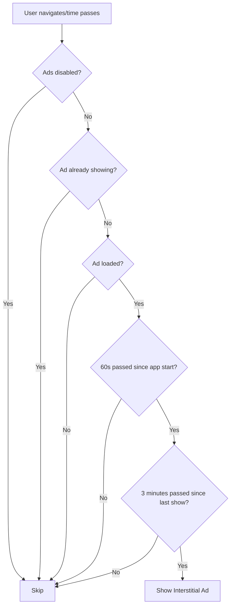

# 📺 Automatic Interstitial Ads Implementation

## ✅ What's Been Implemented

I've enhanced the `AdService` to automatically show interstitial ads based on:

1. ⏰ **Time-based triggers** (every 3 minutes)
2. 📍 **Screen navigation triggers** (every 5 screen navigations)
3. 🚀 **App usage duration** (waits 60 seconds after app start)

---

## 🎯 Key Features

### 1. **Automatic Timer-Based Ads**

- Shows interstitial ads automatically every **3 minutes**
- Waits **60 seconds** after app start before showing first ad
- Non-intrusive family-friendly frequency

### 2. **Navigation-Based Ads**

- Tracks screen navigation count
- Shows ad every **5 screen changes**
- Uses GetX middleware for automatic tracking

### 3. **Smart Ad Management**

- Prevents showing ads when one is already displayed
- Automatically reloads next ad after showing
- Checks ad load status before showing
- Respects Play Store submission flag

---

## 📂 Files Modified/Created

### Modified Files:

1. **`lib/services/ads/ad_service.dart`**

   - Added automatic timer system
   - Added navigation tracking
   - Enhanced interstitial ad showing logic
   - Added safety checks to prevent duplicate shows

2. **`lib/routes/app_pages.dart`**
   - Added `AdTrackingMiddleware` to all routes
   - Automatically tracks screen navigation

### Created Files:

1. **`lib/core/middleware/ad_tracking_middleware.dart`**
   - GetX middleware for tracking navigation
   - Automatically triggers ad logic on screen change

---

## 🔧 How It Works

### Automatic Timer System

```dart
// In AdService initialization
startAutoInterstitialTimer();

// Checks every 1 minute if ad should be shown
// Shows ad if 3 minutes have passed since last show
```

### Screen Navigation Tracking

```dart
// Middleware automatically calls on every screen change
adService.trackScreenNavigation();

// Shows ad every 5th navigation (if time criteria also met)
```

### Ad Showing Logic



---

## 🎮 Usage

### Automatic (No Code Needed)

The system works automatically once initialized:

- ✅ Ads show every 3 minutes
- ✅ Ads show every 5 screen navigations
- ✅ No manual calls required

### Manual Control (Optional)

You can still manually control ads:

```dart
// Get AdService instance
final adService = Get.find<AdService>();

// Manually show interstitial ad
adService.showInterstitialAd(
  onAdClosed: () {
    print('Ad closed');
  },
);

// Check if ad should be shown
if (adService.shouldShowInterstitialAdByTime()) {
  adService.autoShowInterstitialAd();
}

// Track navigation manually (already done by middleware)
adService.trackScreenNavigation();
```

---

## ⚙️ Configuration

### Timing Settings (in `ad_service.dart`):

```dart
// Time before first ad shows (line ~366)
if (timeSinceAppStart.inSeconds < 60) {  // Change 60 to your value
  return false;
}

// Time between ads (line ~371)
return timeSinceLastShow.inSeconds >= 180;  // Change 180 (3 min) to your value

// Navigation frequency (line ~381)
if (_screenNavigationCount % 5 == 0) {  // Change 5 to your value
  showInterstitialAd();
}

// Timer check interval (line ~396)
Future.delayed(const Duration(minutes: 1)) {  // Change 1 to your value
  // ...
}
```

### Disable for Play Store Review:

```dart
// In ad_service.dart (line ~42)
static const bool _disableAdsForStore = true;  // Set to true for review
```

---

## 📊 Ad Frequency Examples

| Setting              | Value       | Result                  |
| -------------------- | ----------- | ----------------------- |
| Time between ads     | 180 seconds | Ad every 3 minutes      |
| Navigation frequency | 5 screens   | Ad every 5th screen     |
| App start delay      | 60 seconds  | No ads for first minute |
| Timer check          | 1 minute    | Checks every minute     |

---

## 🧪 Testing

### Test Automatic Ads:

1. **Run the app:**

   ```bash
   flutter run --release
   ```

2. **Wait 60 seconds** (app start delay)

3. **Navigate between screens 5 times:**

   - Home → Prayer Times → Quran → Settings → Back to Home
   - Should trigger ad after 5th navigation

4. **Wait 3 minutes:**

   - Timer should automatically show ad

5. **Check console logs:**
   ```
   🚀 Starting automatic interstitial ad timer
   📍 Navigating to: /prayer-times
   🎯 Auto-showing interstitial ad after 5 screen navigations
   📺 Showing interstitial ad...
   ✅ Interstitial ad dismissed
   ⏰ Auto-showing interstitial ad based on time
   ```

---

## 🔍 Console Logs

The system provides detailed logging:

- `🚀 Starting automatic interstitial ad timer` - Timer started
- `📍 Navigating to: /route` - Screen navigation detected
- `🎯 Auto-showing interstitial ad after 5 screen navigations` - Navigation trigger
- `⏰ Auto-showing interstitial ad based on time` - Time trigger
- `📺 Showing interstitial ad...` - Ad is showing
- `✅ Interstitial ad dismissed` - User closed ad
- `❌ Interstitial ad failed to show` - Ad error
- `⚠️ Interstitial ad already showing` - Duplicate prevented
- `⚠️ Interstitial ad not ready` - Ad not loaded

---

## 🐛 Troubleshooting

### Ad Not Showing Automatically

**Check:**

1. ✅ Ads enabled: `_disableAdsForStore = false`
2. ✅ 60 seconds passed since app start
3. ✅ 3 minutes passed since last ad
4. ✅ Ad is loaded: Check `Interstitial ad loaded successfully`
5. ✅ No ad currently showing

**Solution:**

```dart
// Check ad status
final adService = Get.find<AdService>();
print('Ad loaded: ${adService.isInterstitialAdLoaded.value}');
print('Can show: ${adService.shouldShowInterstitialAdByTime()}');
```

### Ads Showing Too Frequently

**Adjust timing:**

```dart
// In shouldShowInterstitialAdByTime() (line ~371)
return timeSinceLastShow.inSeconds >= 300;  // 5 minutes instead of 3

// In trackScreenNavigation() (line ~381)
if (_screenNavigationCount % 10 == 0) {  // Every 10 screens instead of 5
```

### Ads Not Showing on Navigation

**Check middleware:**

```dart
// Ensure middleware is added to routes in app_pages.dart
GetPage(
  name: Routes.HOME,
  page: () => HomeScreen(),
  middlewares: [AdTrackingMiddleware()],  // Must be present
),
```

---

## 📝 Best Practices

### Family-Friendly Configuration:

- ✅ Wait 60 seconds after app start
- ✅ Show every 3 minutes (not too frequent)
- ✅ Show every 5 screen changes (not intrusive)
- ✅ Always show close button (no immersive mode)
- ✅ Load ad in background for smooth experience

### Performance Optimization:

- ✅ Timer checks every 1 minute (not every second)
- ✅ Prevent duplicate ad shows
- ✅ Auto-reload next ad after showing
- ✅ Respect user experience with delays

### Testing Before Release:

1. Test with `_disableAdsForStore = true` for review
2. Test with `_disableAdsForStore = false` for production
3. Verify timing on real device
4. Check memory usage over time
5. Test ad loading failure scenarios

---

## 🔄 Migration from Manual to Automatic

### Old Way (Manual):

```dart
// Manually call in every screen
if (adService.shouldShowInterstitialAd()) {
  adService.showInterstitialAd();
}
```

### New Way (Automatic):

```dart
// Nothing needed! System handles it automatically
// Middleware + Timer = Automatic ads
```

---

## 📈 Monitoring

Track ad performance:

```dart
// In AdService
print('Total navigations: $_screenNavigationCount');
print('Last ad shown: $_lastInterstitialShowTime');
print('App running for: ${DateTime.now().difference(_appStartTime)}');
```

---

## 🎯 Summary

✅ **Automatic time-based ads** (every 3 minutes)  
✅ **Automatic navigation-based ads** (every 5 screens)  
✅ **Smart delay** (60 seconds after app start)  
✅ **Duplicate prevention** (no overlapping ads)  
✅ **Family-friendly frequency** (non-intrusive)  
✅ **Easy configuration** (change timing values)  
✅ **Console logging** (detailed debugging)  
✅ **Middleware tracking** (automatic navigation detection)

---

**Your interstitial ads now show automatically! 🚀**

**No manual code needed in screens!**

**Family-friendly and non-intrusive!**
